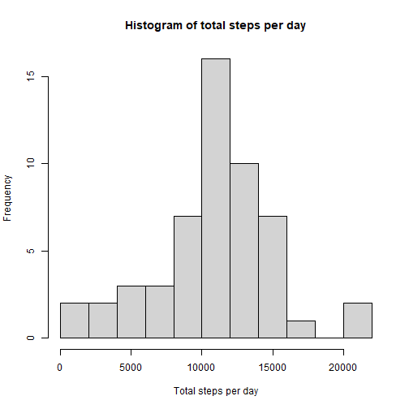
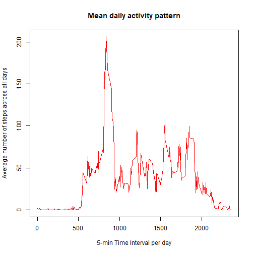
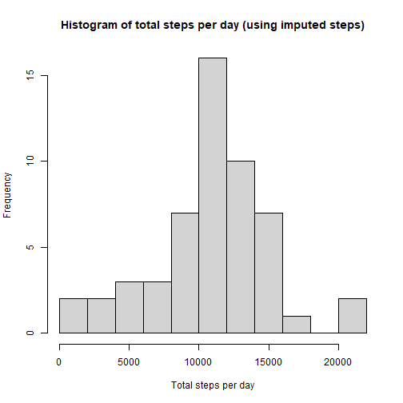
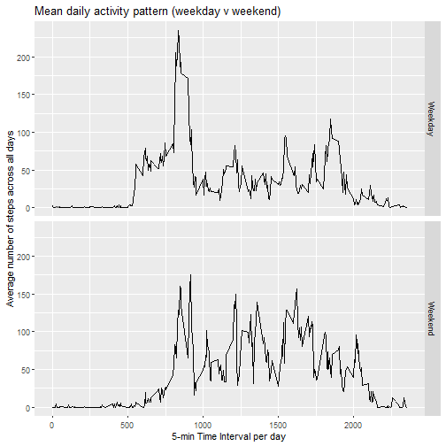

``` r
knitr::opts_chunk$set(echo = TRUE,  scientific=FALSE)
```

Full details of the assignment can be found at [Assignment GitHub](%5Bhttps://github.com/rdpeng/RepData_PeerAssessment1%5D)


## Loading and preprocessing the data

First read in packages that will be needed for the analysis. Then, if zip file not already downloaded, download and unzip file ready for use.


``` r
library(dplyr)
library(ggplot2)
library(lubridate)
```


``` r
zipnam <- "repdata_data_activity.zip"
if(!file.exists(zipnam)) {
  zipurl <- "https://d396qusza40orc.cloudfront.net/repdata%2Fdata%2Factivity.zip"
  download.file(url=zipurl,destfile=zipnam)
}
if(!(file.exists("activity.csv"))) { unzip("activity.zip") }
```

Read in the data to R


``` r
actdata <- read.csv(file="activity.csv", header=TRUE)
actdata$date2 <-as.Date(actdata$date)
```

## What is mean total number of steps taken per day?

Sumarise total steps by date and create histogram


``` r
totstep<-actdata %>%
    group_by(date2) %>%
    summarise(tspd=sum(steps))

summary(totstep)
```

```
##      date2                 tspd      
##  Min.   :2012-10-01   Min.   :   41  
##  1st Qu.:2012-10-16   1st Qu.: 8841  
##  Median :2012-10-31   Median :10765  
##  Mean   :2012-10-31   Mean   :10766  
##  3rd Qu.:2012-11-15   3rd Qu.:13294  
##  Max.   :2012-11-30   Max.   :21194  
##                       NA's   :8
```

``` r
 hist(totstep$tspd, main="Histogram of total steps per day", xlab="Total steps per day", ylab="Frequency", breaks=15)
```



``` r
 meanstep<-round(mean(totstep$tspd, na.rm = TRUE), digits=1)
 medstep<-median(totstep$tspd, na.rm = TRUE)
```
Mean number of steps per day is 10766.2. 
Median number of steps per day is 10765. 

## What is the average daily activity pattern?

Calculate and plot means steps for each interval across all days


``` r
 intstep<-actdata %>%
      group_by(interval) %>%
      summarise(meanspi=mean(steps, na.rm = TRUE))
      
with(intstep, plot(interval, meanspi, type="l", col ="red", 
                   main='Mean daily activity pattern', xlab='5-min Time Interval per day',
                   ylab='Average number of steps across all days'))
```



Take the interval which has the max mean steps across all dates


``` r
maxint<-intstep[which.max(intstep$meanspi),1:2]
maxint
```

```
## # A tibble: 1 × 2
##   interval meanspi
##      <int>   <dbl>
## 1      835    206.
```
Interval with max steps is 835

## Imputing missing values

Calculate number of rows with missing steps


``` r
missrow<-sum(!complete.cases(actdata$steps))
```

Number of missing rows is 2304

Impute intervals with missing steps with the floor of the mean of steps for that interval across all days\
Plot a histogram of this data for comparison with the earlier histogram and calculate the mean/median for number of steps


``` r
impute_data<-actdata %>%
             group_by(interval) %>%
             mutate(imp_steps= ifelse(is.na(steps), floor(mean(steps, na.rm=TRUE)), steps))
  
impute_sum<-impute_data %>%
            ungroup(interval) %>%
            group_by(date) %>%
            summarise(itspd=sum(steps))

hist(impute_sum$itspd, main="Histogram of total steps per day (using imputed steps)", xlab="Total steps per day", ylab="Frequency", breaks=15)
```



``` r
imeanSteps <- mean(impute_sum$itspd, na.rm = TRUE)
imedSteps <- median(impute_sum$itspd, na.rm = TRUE)
```

Original data mean is 10766.2 and imputed mean is 10766.19. Similarly 
original data median is 10765 and imputed mean is 10765.
So there is an insignifiant difference in the means and medians by choosing this imputation method.

## Are there differences in activity patterns between weekdays and weekends?

Split days in to weekday or weekend and plot a line graph for each


``` r
impute_data$daytype<-ifelse(weekdays(impute_data$date2) %in% c("Saturday", "Sunday"), "Weekend", "Weekday")


impbytype<-impute_data %>%
  group_by(interval, daytype) %>%
  summarise(meanspi=mean(steps, na.rm = TRUE))
```

```
## `summarise()` has grouped output by 'interval'. You can override using the `.groups` argument.
```

``` r
ggplot(impbytype, aes(interval, meanspi)) + 
  geom_line() + xlab("5-min Time Interval per day") + ylab("Average number of steps across all days") + facet_grid(daytype ~ .) +
  ggtitle("Mean daily activity pattern (weekday v weekend)")
```


